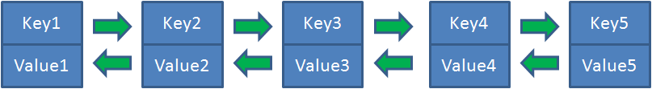

# LRU

LRU（Least Recently Used，最近最少使用）是一种 Cache 替换算法。

Cache 的容量有限，因此当 Cache 的容量用完后，而又有新的内容需要添加进来时，就需要挑选并舍弃原有的部分内容，从而腾出空间来放新内容。LRU Cache 的替换原则就是将最近最少使用的内容替换掉。

## 实现方式

LRU 可以使用哈希链表(LinkedHashMap)来实现，从而实现 put 和 get 的时间复杂度都是 O(1)。

