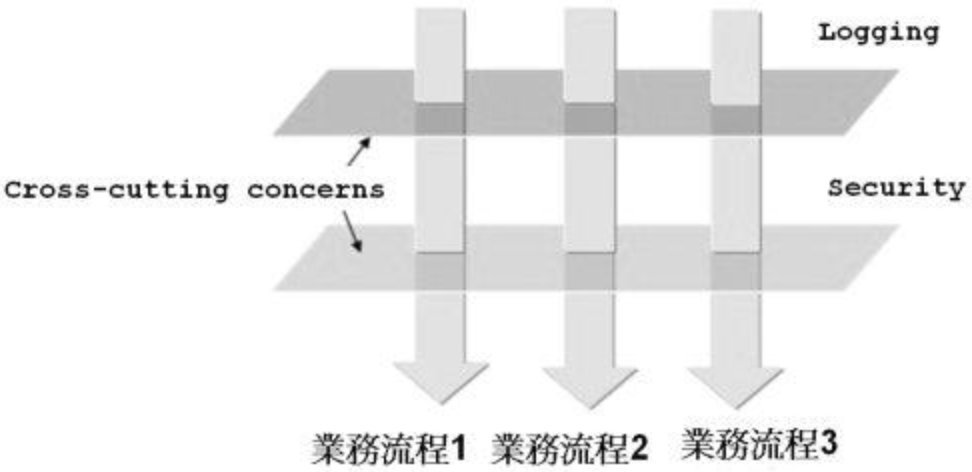

# 面向切面编程 Aspect-Oriented Programming

在软件开发中，散布于应用中多处的功能被称为 **横切关注点**（cross-cutting concern）。通常来讲，这些横切关注点从概念上讲是与业务逻辑相分离的（但是往往会直接嵌入到应用的业务逻辑之中）。
把这些横切关注点与业务逻辑相分离正是面向切面编程（AOP）所要解决的问题。



## AOP 概念

AOP 中常用术语有：

- 切面（Aspect）
  也就是上面提到的横切关注点，如图中所示的 Logging 和 Security
- 连接点（Joinpoint）
  连接点是在应用执行过程中能够插入切面的一个点。比如调用方法时、抛出异常时，甚至修改一个字段时。切面代码利用这些点插入到应用的正常流程之中，并添加新的行为。
- 通知（Advice）
  通知定义了切面是什么以及何时使用。
- 切点（Pointcut）
  切点是一个满足连接点的正则表达式，当连接点满足匹配切点时，通知才被执行。通知定义了切面的 "什么" 和 "何时" 使用，而切点定义了切面的 "何处"。
- 织入（Weaving）
  织入是把切面应用到目标对象并创建新的代理对象的过程。

### Spring 中的 Advice

在 Spring 中，切面可以应用 5 种类型的通知：

- 前置通知（Before）：在目标方法被调用之前调用
- 后置通知（After）：在目标方法完成之后调用通知，此时不会关心方法的输出是什么
- 返回通知（After-returning）：在目标方法成功执行之后调用通知
- 异常通知（After-throwing）：在目标方法抛出异常后调用通知
- 环绕通知（Around）：通知包裹了被通知的方法，在被通知的方法调用之前和调用之后执行自定义行为

### 织入的时机

在目标生命周期里有多个点可以进行织入：

- 编译期：切面在目标类编译时被织入。这种方式需要特殊的编译器。AspectJ 的织入编译器就是以这种方式织入切面的。
- 类加载期：切面在目标类加载到 JVM 时被织入。这种方式需要特殊的类加载器（ClassLoader），它可以在目标类被引入应用之前增强该目标类的字节码。
AspectJ 5 的加载时织入（load-time weaving, LTW）就支持以这种方式织入切面。
- 运行期：切面在应用运行的某个时刻被织入。一般情况下，在织入切面时，AOP 容器会为目标对象动态地创建一个代理对象。Spring AOP 就是以这种方式织入切面的。

### 切点表达式

如上所述，切点（Pointcut）用于准确定位应该在什么地方应用切面（Aspect）的通知（Advice）。通知和切点是切面的最基本元素。因此，了解如何编写切点非常重要。

#### Spring 中的切点表达式

Spring AOP 仅支持 AspectJ **切点指示器**（pointcut designator）的一个子集。因为 Spring 是基于代理的，而某些切点表达式是与基于代理的 AOP 无关的。

Spring 借用 AspectJ 的切点表达式语言来定义 Spring 切面，支持切点指示器列表见：[官方文档](https://docs.spring.io/spring/docs/current/spring-framework-reference/core.html#aop-pointcuts)

在文档中的指示器中，可以看到：

> execution: For matching method execution join points. This is the primary pointcut designator to use when working with Spring AOP.

只有 `execution` 指示器是实际执行匹配的，而其他指示器都是用来限制匹配的。`execution` 指示器是编写切点定义时最主要使用的指示器，在此基础上，使用其他指示器来限制所匹配的切点。

假设有一个 `Performance` 接口：

```java
package aop;

public interface Performance {
    void perform();
}
```

下面切点表达式设置当 `perform()` 方法执行时触发通知的调用：

```
execution(* aop.Performance.perform(..))
```

`execution` 表示在方法执行时触发；`*` 表示不关心返回值的类型；然后是全限定类名和方法名 `aop.Performance.perform`，对于方法参数列表，我们使用两个点号 `(..)` 表明切点要选择任意的 `perform` 方法，无论方法的入参是什么。

如果需要限制切点仅匹配 aop 包，可以使用 `within()` 指示器来限制匹配。如：

```
execution(* aop.Performance.perform(..)) && within(aop.*)
```

在 Spring 中，还有一个新的指示器 `bean()`，可以在切点表达式中使用 bean 的 ID 来标识 bean。`bean()` 使用 bean ID 或 bean 的名称作为参数来限制切点只匹配特定的 bean。如：

```
execution(* aop.Performance.perform(..)) && bean(woodstock)
```

如果拦截的参数带参数，可以使用 `args()` 来绑定参数。

```
execution(* aop.Performance.perform(..)) && args(name, time)
```

在调用 proceed 方法时，使用对象数组将参数传入：

```java
@Around("performance() && args(name, time)")
public void watchPerformance(ProceedingJoinPoint jp, String name, int time) {
    try {
        System.out.println("Silencing cell phones");
        System.out.println("Taking seats...");
        jp.proceed(new Object[]{"(" + name + ")", time * 10});
        System.out.println("CLAP CLAP CLAP!!!");
    } catch (Throwable throwable) {
        throwable.printStackTrace();
    }
}
```

#### 使用注解定义切面

- `@Aspect` 表明该类是一个切面
- `@Before`、`@After`、`@AfterReturning`、`@AfterThrowing`、`@Around` 分别对应上文所述通知中的 5 种类型。

另外，使用 `@Pointcut` 可以定义一个切点表达式以在别处使用。

[查看 Demo](./Demo.java)

## Spring 中的 AOP

Spring AOP 构建在动态代理基础之上，因此，Spring 对 AOP 的支持局限于方法拦截。
