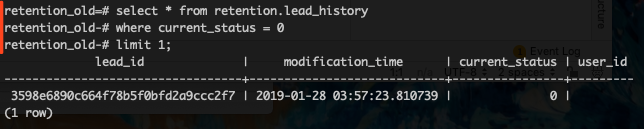
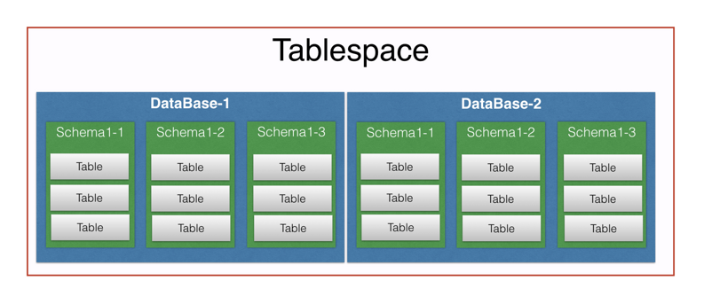

# PostgreSQL

## 一、Postgres 基础

### 分号

注意 psql 的命令以分号结尾，命令行前缀为 `postgres=#`，如果不加分号回车，会变为 `postgres-#`。



## 二、常见用法

### 1）psql 相关

#### 连接 psql

```bash
psql -U <username> -p 5432
```

#### 退出 psql

```postgresql
\q
```

#### 查看帮助

```postgresql
\?
```

#### 格式化输出

```postgresql
\x
```

toggle expanded output

### 2）数据库相关

#### 显示所有数据库

```postgresql
\l
```

#### 连接数据库

````postgresql
\c <database name>
````

#### 重命名数据库

````postgresql
alter database <old name> rename to <new name>;
````

#### 创建数据库

````postgresql
create database <database name>
````

### 3）Schema 相关

#### 显示所有 schema

```postgresql
\dn
```

#### 显示 search path

```postgresql
show search_path;
```

#### 切换 search path

```postgresql
set search_path to <schema name>;
```


#### 创建 schema

```postgresql
CREATE SCHEMA <schema name>;
```

### 4）表相关

#### 查看所有表

```postgresql
\d
```

## 三、Schema

在 psql 中有表空间（tablespace）、数据库（database）和模式（schema）的概念

> tablespace 是物理结构，同一表空间下可以有多个 database
database 是逻辑结构，是表／索引／视图／存储过程的集合，一个 database 下可以有多个schema
schema 是逻辑结构，是对 database 的逻辑划分



可以把 schema 理解为操作系统中的目录，只不过 schema 不能嵌套。

创建表时，可以为表指定 schema，如

```postgresql
CREATE TABLE myschema.mytable (
 ...
);
```

如果不指定，这个表会自动放到名为 "public" 的 schema 中，所有新建的数据库都默认带有这个 schema。

参考：https://www.postgresql.org/docs/8.1/ddl-schemas.html

## 四、常见场景

### 1）导入数据

#### 从 csv 导入单表

```postgresql
copy lead from '/home/downloads/lead.csv' csv;
```

注意：如果 csv 文件是带头的，也就是第一行是列名，那么需要加上 with csv header：

```postgresql
copy lead from '/home/downloads/lead.csv' with csv header;
```

如果你是在 docker 容器中进行此操作，需要注意指定的 path 是容器的 path，可以先把宿主机的文件先拷到容器中：

```bash
docker cp <filename> <docker container>:<path>
```

#### 从 sql 文件导入数据库

```bash
psql -U <username> -d <database> -f <filename>;
```

需要提前新建好数据库。
